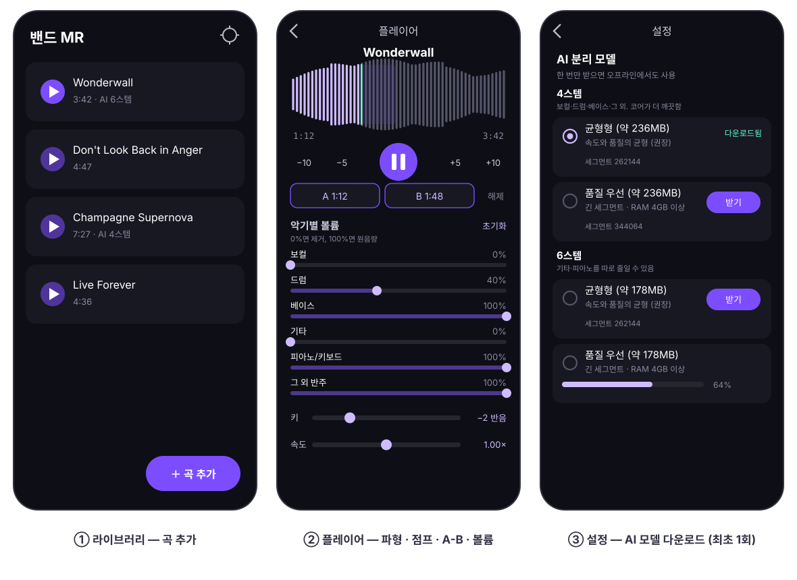
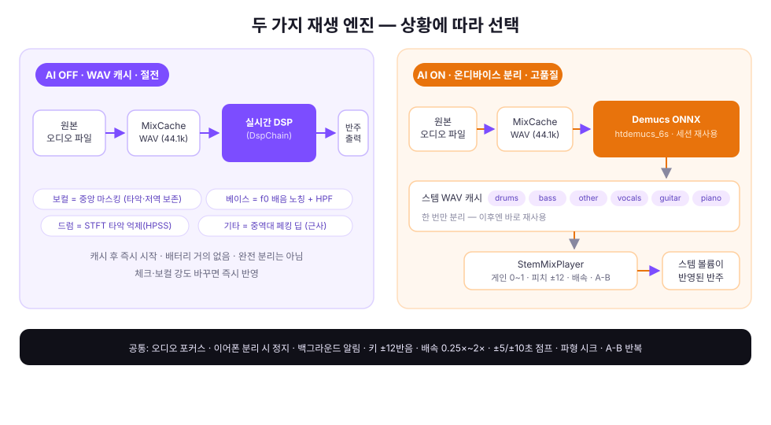
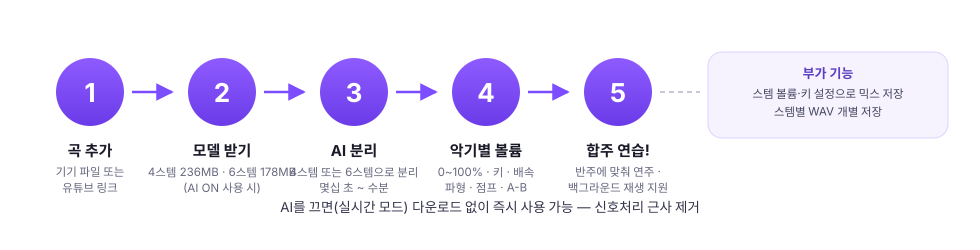

# 밴드 MR (Band MR)

밴드 연습용 MR 제거 앱 (Android). 곡에서 **보컬 / 드럼 / 베이스 / 기타 / 피아노(키보드) / 그 외**를 악기별로 줄이거나 제거하고 남은 반주로 합주 연습을 할 수 있습니다.

> 스템 분리에는 [Demucs](https://github.com/facebookresearch/demucs) (MIT, Meta Platforms)의
> htdemucs_6s 가중치를 사용합니다. 서드파티 라이선스 고지는 [THIRD_PARTY_NOTICES.md](THIRD_PARTY_NOTICES.md)를 참고하세요.

📊 **그림으로 보는 소개 페이지**: [docs/index.html](docs/index.html)

## 주요 기능

| 기능 | 설명 |
|---|---|
| 스템별 볼륨 | AI ON(분리 후): 보컬·드럼·베이스·기타·피아노·그 외를 0~100%로 조절 (0%=제거). AI OFF: 체크 제거(피아노·그 외는 AI 전용) |
| AI ON/OFF | OFF: 실시간 신호처리(절전) / ON: 온디바이스 AI 분리(고품질) |
| 보컬 제거 강도 | AI OFF에서 0~100% 슬라이더 조절 (낮음=반주 보존, 높음=최대 제거, 재생 중 즉시 반영) |
| 키 조절 | ±12반음 (옥타브 포함), 세미톤 단위 피치 시프트 |
| 속도 조절 | 0.25×~2× (0.05 단위). 키와 독립, 곡마다 저장. 재생만 적용 |
| 구간 점프 | −10 / −5 / +5 / +10초. 곡 시작·끝(A-B가 켜져 있으면 그 구간)을 넘지 않음 |
| 파형 시크 | MixCache 개요 파형에서 탭·드래그로 위치 이동. 드래그 중에도 재생이 따라감. 캐시 준비 중엔 슬라이더(완료되면 자동 전환) |
| A-B 반복 | 시작(A)·끝(B)을 지정하면 그 구간만 반복. 배속·키 유지, 곡마다 저장. 0.5초 이상 |
| 백그라운드 재생 | 화면을 벗어나거나 홈으로 나가도 재생 유지. 알림에서 −10/−5/재생·일시정지/+5/+10초 조작 |
| 내보내기 | ① 스템 볼륨·키 설정으로 믹스 WAV 저장(배속·A-B는 넣지 않음) ② 스템별 WAV 개별 저장 |
| 모델 3종 | 경량/균형/품질 (세그먼트 길이 차이, 각 약 178MB) 선택 다운로드 |
| 유튜브 가져오기 | 링크로 오디오를 받아 곡으로 등록. 화면을 열어 둔 채 받아야 함 |



## 재생 정책

- **이어폰 분리**: 이어폰/블루투스가 분리되면 즉시 일시정지됩니다.
- **백그라운드**: 플레이어 화면을 닫거나 홈으로 나가도 재생이 계속되며, A-B 반복도 화면과 무관하게 유지됩니다.
- **알림 컨트롤**: MediaSession을 붙여 OS 미디어 플레이어 카드로 표시됩니다. 앱과 같은 5개 버튼(−10 / −5 / 재생·일시정지 / +5 / +10초)과 진행바를 제공하고, 잠금화면·블루투스 조작도 동작합니다. 앱에서 파형을 움직이면 진행바가 즉시 따라옵니다.
- **종료**: 알림을 밀어서 지우거나 최근 앱 목록에서 앱을 치우면 재생이 정리됩니다(홈으로 나가는 것만으로는 종료되지 않습니다).

## AI ON/OFF 동작 방식



<details>
<summary>텍스트로 보기</summary>

```
AI OFF (WAV 캐시, 절전)
  원본 파일 ──▶ MixCache(44.1kHz WAV) ──▶ SourceWavPlayer(DspChain)
                                      ├ 보컬 제거: STFT 패닝 인덱스 중앙 마스킹 (저역 중앙 성분 보존)
                                      ├ 베이스 제거: STFT f0 배음 노칭 + 하이패스 2단
                                      ├ 드럼 제거: STFT HPSS 타악 억제 (근사)
                                      └ 기타 제거: 중역대 페킹 딥 (실험적)

AI ON (사전 분리 후 캐시, 고품질)
  원본 파일 ──▶ MixCache(44.1kHz WAV) ──▶ Demucs ONNX 추론(6스템, 고정 세그먼트)
             ──▶ 스템별 WAV 캐시 ──▶ 커스텀 믹서로 동기 재생 + 게인/피치/배속
```

</details>



- **AI OFF**: 즉시 반응하고 배터리를 거의 쓰지 않지만, 신호처리 특성상 완전히 분리되진 않습니다(특히 기타).
- **AI ON**: 곡당 한 번만 처리하면 캐시로 재사용되며, 스템별 볼륨(0~100%)으로 정확히 조절됩니다.
  - 경량: 몇십 초 ~ 1분 내외 / 품질: 수분 소요, 발열 있음

## 빌드

요구사항: Android Studio Quail 2(2026.1.2) 이상, JDK 17+, Android SDK 37

```bash
# Android Studio에서 열거나
./gradlew assembleDebug
adb install app/build/outputs/apk/debug/app-debug.apk
```

minSdk 31 (Android 12+) / targetSdk 36

## 🤖 AI 모델

AI를 ON하면 설정에서 모델 3종 중 하나를 선택해 다운로드할 수 있습니다.
모델은 이 저장소의 [Releases](https://github.com/hyuunnn/band-mr/releases/tag/model-v2)에
호스팅되어 있으며, 다운로드 시 SHA-256 무결성이 검증됩니다.

| 등급 | 세그먼트 | 특징 |
|---|---|---|
| 경량 우선 | 131,072 샘플 (약 3초) | 빠름, 저메모리 |
| 균형형 (권장) | 262,144 샘플 (약 6초) | 속도·품질 균형 |
| 품질 우선 | 344,064 샘플 (약 7.8초) | 최고 품질, 메모리 많음 |

### 모델 재변환 방법 (참고용)

htdemucs_6s(Demucs v4, 6스템)는 `torch.stft`의 complex 출력 때문에 그대로는 ONNX export가 되지 않는다.
`demucs.spec`의 spectro/iSTFT를 실수(re/im 쌍) 연산으로 교체하고, `nn.MultiheadAttention`을
기본 연산으로 분해한 뒤 opset 18로 export해야 한다.

변환 스크립트: [`tools/export_demucs_onnx.py`](tools/export_demucs_onnx.py) (검증까지 자동 수행)

```bash
python3 -m venv venv && source venv/bin/activate
pip install torch torchaudio demucs onnx onnxruntime onnxscript onnxconverter-common
python tools/export_demucs_onnx.py <출력폴더>
# 성공 시 모델 3종 + SHA-256 해시 출력 → Releases 업로드 후 ModelCatalog.kt 갱신
```

## 프로젝트 구조

```
app/src/main/java/com/bandmr/app/
├── MainActivity.kt            # 네비게이션 (라이브러리/플레이어/설정)
├── BandMrApp.kt               # Application + 수동 DI(Locator)
├── audio/
│   ├── AudioTrackEngine.kt    # 두 재생 엔진 공통 골격 (스레드 루프·A-B·시크·배속·AudioTrack)
│   ├── DspChain.kt            # STFT 스펙트럼 단계 + 바이쿼드 체인 (실시간·오프라인 공용)
│   ├── SpectralStage.kt       # 드럼=HPSS 타악 억제 / 베이스=f0 배음 노칭
│   ├── Fft.kt                 # radix-2 FFT (사전 계산 트위들 테이블)
│   ├── Biquad.kt              # RBJ cookbook 바이쿼드 (스펙트럼 단계·리샘플러 사용)
│   ├── MixCache.kt            # 원본 → 44.1kHz WAV 캐시 1패스 생성(filesDir/mixcache). 완료는 awaitReady 신호
│   ├── SourceWavPlayer.kt     # WAV 캐시 + DspChain 실시간 재생 (AudioTrack)
│   ├── PitchShift.kt          # ±12반음 피치 시프터 (0반음은 패스스루)
│   ├── PlaybackSpeed.kt       # 재생 배속 0.25~2.0 (AudioTrack PlaybackParams)
│   ├── PlaybackSkip.kt        # ±5/±10초 점프 (0~duration 클램프)
│   ├── PlaybackLoop.kt        # A-B 구간 반복 (최소 0.5초, 시크/점프도 구간 안)
│   ├── WaveformPeaks.kt       # MixCache WAV → 개요 파형 (막대 RMS 정규화, <songId>.peaks로 캐시)
│   ├── StemMixPlayer.kt       # 스템 6개 동기 재생 믹서 (AudioTrack)
│   ├── StemWavSet.kt          # 스템 WAV 묶음 열기 (누락 스킵·44.1k 불일치 제외·최장 길이) — 재생·내보내기 공용
│   ├── PlayerController.kt    # 두 엔진 전환/오디오 포커스/파라미터 적용
│   └── WavIo.kt               # WAV 읽기/스트리밍 쓰기 (little-endian)
├── io/FilePromote.kt          # .part/.tmp → 정식 경로 승격 (rename 실패 시 copy, 실패 시 목적지 정리)
├── playback/
│   └── PlaybackService.kt     # 백그라운드 재생 FGS + MediaSession 알림(점프 5버튼·진행바)
├── separation/
│   ├── ModelCatalog.kt        # 모델 3종 정의 (URL·SHA-256 핀)
│   ├── ModelManager.kt        # 다운로드(이어받기·SHA-256 검증)/삭제/상태
│   ├── AudioDecode.kt         # MediaCodec → 44.1kHz 스테레오 PCM16 스트림 (MixCache용, 1패스)
│   ├── DemucsSeparator.kt     # MixCache WAV 입력 + ONNX 추론 + 오버랩 크로스페이드
│   │                          # ONNX 세션은 분리 1회마다 열고 닫음(메모리 반환)
│   ├── SeparationService.kt   # Foreground Service + 진행 알림
│   └── SepBus.kt              # 서비스↔UI 상태 버스
├── youtube/
│   ├── YouTubeUrl.kt          # 유튜브 링크 파싱·스트림 선택
│   └── YouTubeImporter.kt     # NewPipeExtractor 다운로드 → Song + MixCache
├── export/Exporter.kt         # 믹스/스템 내보내기 (MixCache WAV 재사용, 배속·A-B 제외)
├── data/                      # Room(Song v4: stemGains/mute/키/배속/A-B), DataStore(설정). 저장은 컬럼별 UPDATE
└── ui/                        # Compose (라이브러리/플레이어/설정)
    └── player/WaveformBar.kt  # 파형 시크바 (탭·드래그, A-B 오버레이)

tools/export_demucs_onnx.py    # htdemucs_6s → ONNX 변환 스크립트 (검증 포함)
```

## 테스트

```bash
./gradlew :app:testDebugUnitTest   # FFT/WAV/Biquad/피치시프트/배속/점프/루프/파형/캐시준비신호/STFT/DSP리셋/리샘플러/청크/스템 게인/유튜브/파일 승격 단위 테스트 (119개)
```

## 알려진 한계

- 비AI 모드의 기타 제거는 근사 처리입니다(정확한 분리는 AI 모드 사용).
- 비AI 모드의 드럼 제거는 STFT 기반 HPSS 근사로, 실제 트랜지언트 일부가 함께 약해질 수 있습니다.
- 피치 시프터는 실시간용 그래뉼러 방식으로 ±5반음 이상에서 워블 아티팩트가 있을 수 있습니다.
- 재생 배속은 AudioTrack 타임스트레치라, 일부 기기는 0.25×처럼 느린 값을 거부할 수 있습니다.
- 품질 우선 모델은 메모리를 많이 사용하므로 RAM 4GB 이상 기기를 권장합니다.
- 모델 파일이 약 178MB라 최초 다운로드에 시간이 걸릴 수 있습니다 (Wi-Fi 권장).
- 유튜브 가져오기와 모델 다운로드는 화면을 열어 둔 채 진행해야 합니다. 앱을 내리면 끊길 수 있습니다.
- 알림의 점프 버튼 배치는 OS 미디어 카드의 슬롯 규칙에 맞춘 것으로, 갤럭시(One UI)에서 확인했습니다. 제조사 스킨에 따라 순서가 달라지거나 커스텀 버튼이 표시되지 않을 수 있습니다.

---

Assisted by GLM-5.3-Flash (Ox Alpha), Grok 4.6
