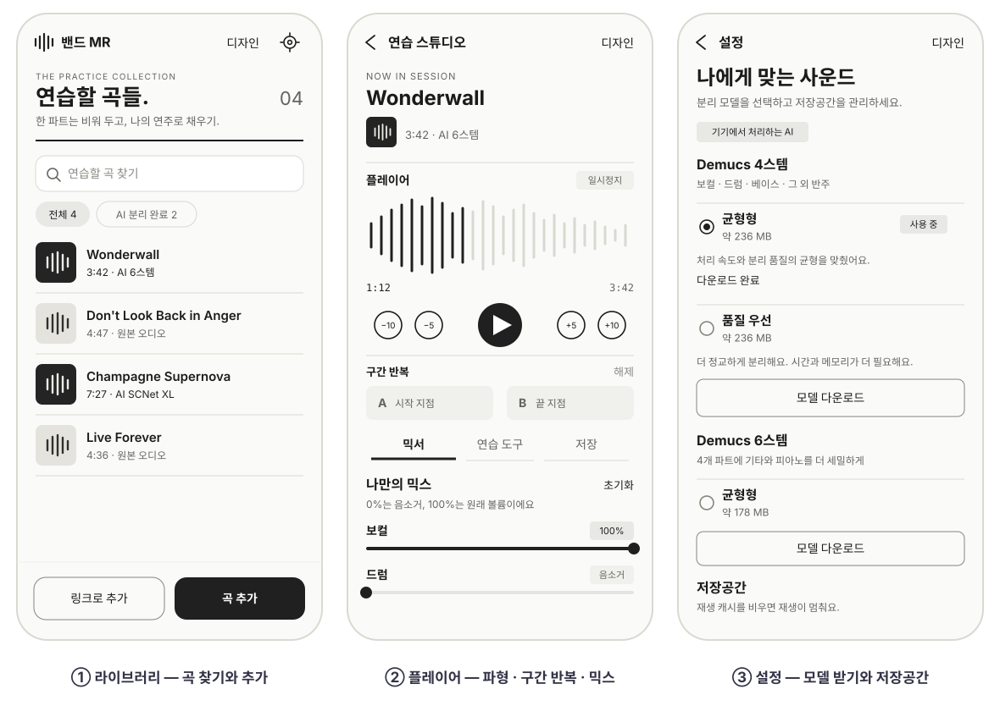

# 밴드 MR (Band MR)

보컬·드럼·베이스·기타·피아노·그 외 소리를 줄여 합주용 반주를 만드는 Android 앱입니다.

[APK 다운로드](https://github.com/hyuunnn/band-mr/releases/latest) · [그림으로 보기](docs/index.html) · [라이선스 고지](THIRD_PARTY_NOTICES.md)

## 사용법

1. 음악 파일이나 유튜브 링크로 곡을 추가합니다.
2. AI OFF로 바로 연습하거나, 설정에서 모델을 받은 뒤 AI 분리를 실행합니다.
3. 악기별 볼륨·키·배속·반복 구간을 조절합니다.
4. 필요하면 믹스 또는 스템별 WAV를 저장합니다.



## 주요 기능

| 기능 | 범위 |
|---|---|
| 악기 조절 | AI OFF: 체크 제거·보컬 강도 조절. AI ON: 4/6스템별 볼륨 0~100%(피아노·그 외는 AI 전용) |
| 키·배속 | ±12반음, 0.25×~2×. 곡마다 저장 |
| 재생 | 파형 시크, ±5/±10초 점프, A-B 반복(최소 0.5초) |
| 백그라운드 | 알림·잠금화면·블루투스 조작. 전화·이어폰 분리 시 일시정지 |
| 저장 | 믹스·스템 WAV 내보내기. 믹스에는 볼륨·키만 적용하며 배속·A-B는 제외 |
| 관리 | 테마 10종, 재생 캐시·분리 결과 정리 |

## AI 모델

설정에서 선택한 모델을 다운로드합니다. 분리는 폰에서 처리하고, 완료된 결과는 재사용합니다.
AI OFF는 모델 없이 동작하는 근사 처리입니다.

| 모델 | 스템 | 용량 |
|---|---|---|
| Demucs htdemucs | 보컬·드럼·베이스·그 외 | 약 236MB |
| Demucs htdemucs_6s | 위 4종 + 기타·피아노 | 약 178MB |
| SCNet XL | 보컬·드럼·베이스·그 외 | 약 286MB |
| SCNet XL IHF | 보컬·드럼·베이스·그 외 | 약 283MB |

Demucs는 균형형·품질 우선을 제공합니다. 품질 우선은 시간과 메모리가 더 필요합니다.
SCNet XL은 Demucs보다 느리고, XL IHF는 XL보다 시간이 더 걸립니다. SCNet은 메모리 4GB 이상인 기기를 권장합니다.
분리 시간은 곡·모델·기기에 따라 달라집니다.
모델은 [model-v3](https://github.com/hyuunnn/band-mr/releases/tag/model-v3)에서 내려받으며 SHA-256을 검증합니다.

## 동작 안내

- 유튜브 입력창의 '닫기'는 작업을 계속하고, '중단'은 확인 팝업을 거쳐 취소합니다.
- 중단 후 다시 추가하면 이전 작업 정리를 기다리며, 대기 중에도 진행 표시와 중단 버튼이 나옵니다.
- 같은 링크를 다시 추가하면 목록에 별도 곡을 등록하고 내려받은 원본은 재사용합니다.
- 유튜브·모델 다운로드는 완료까지 앱을 열어 두는 것을 권장합니다. 백그라운드에서는 중단될 수 있습니다.
- 재분리 취소는 결과 교체 확정 전까지 이전 결과를 보존합니다.
- 알림을 지우거나 최근 앱에서 앱을 치우면 재생이 종료됩니다. 홈으로 나가면 재생을 유지합니다.
- AI OFF·키 변경은 음질에 영향을 줄 수 있고, 일부 기기는 낮은 배속을 지원하지 않습니다.

## 개발

JDK 17, Android SDK 37 필요. Android 13 이상 지원.

```bash
./gradlew :app:testDebugUnitTest
./gradlew :app:assembleDebug
./gradlew :app:assembleRelease
```

배포 APK는 `app/build/outputs/apk/release/app-release.apk`입니다.
릴리즈 서명은 커밋하지 않는 `keystore.properties`로 설정합니다.
동일 서명의 APK는 `adb install -r`로 데이터를 유지하며 업데이트합니다.
릴리즈 태그는 APK를 빌드한 커밋을 가리켜야 합니다.

[개발 규칙·코드 지도](AGENTS.md) · [모델 변환 절차](tools/README.md)
